# POSEMATE

<p align="center">
  <br>
  
  <br>
</p>


<br>

## 프로젝트 소개

<p align="justify">
   
   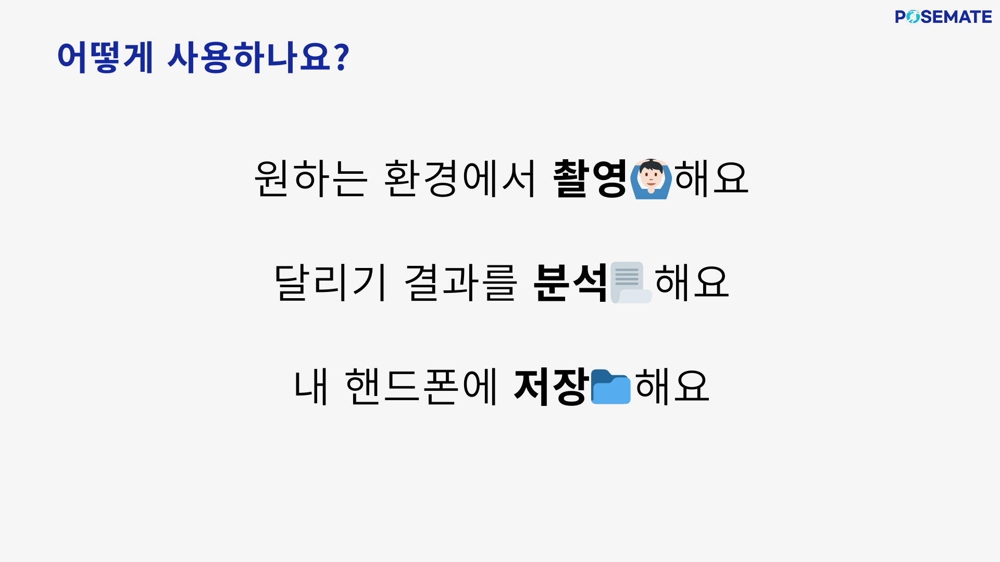
   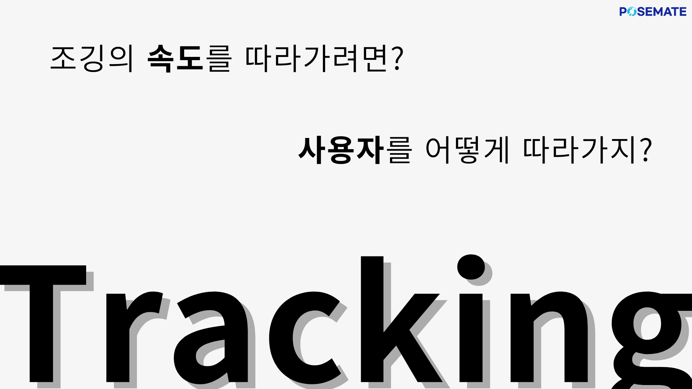
   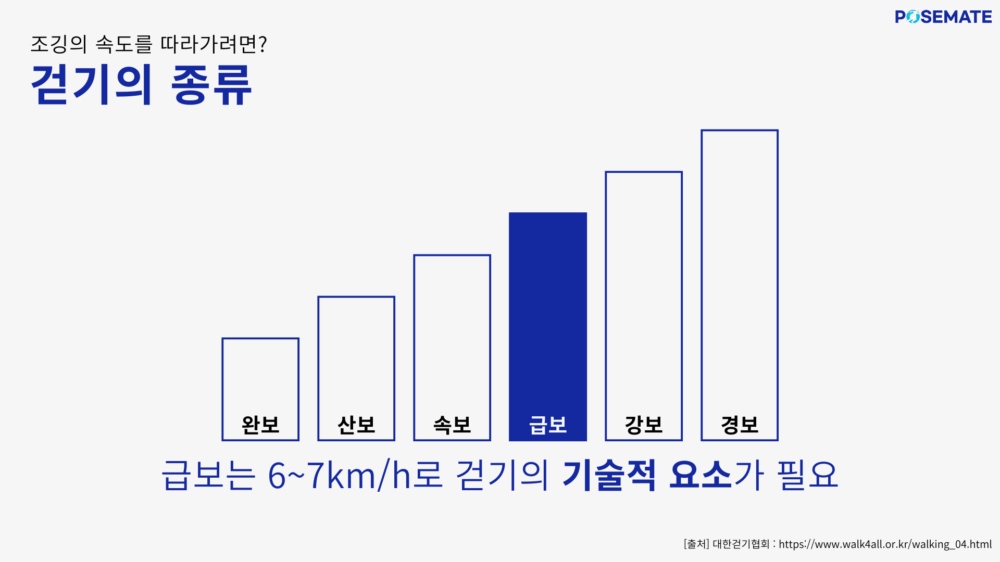
   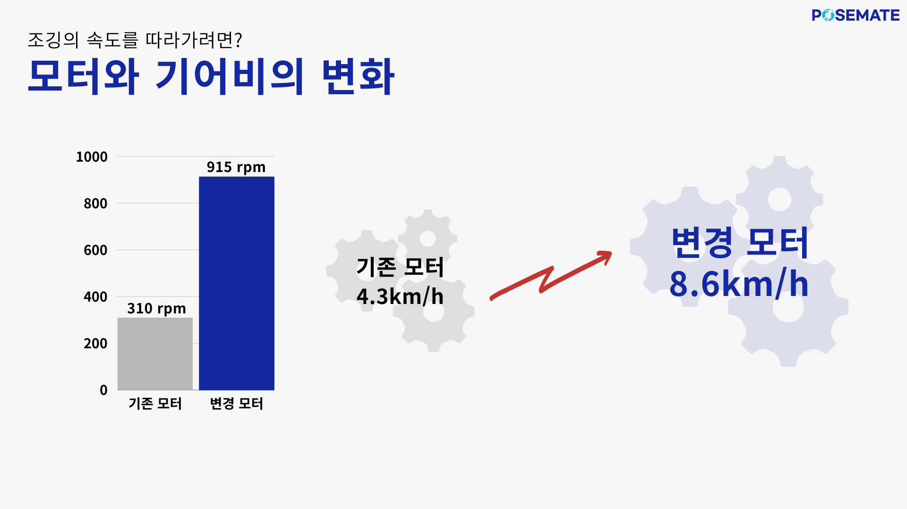
   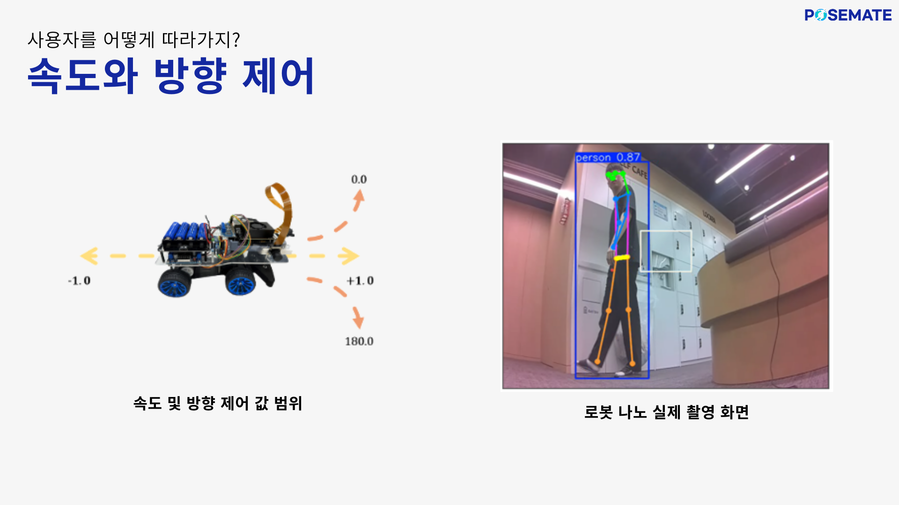
   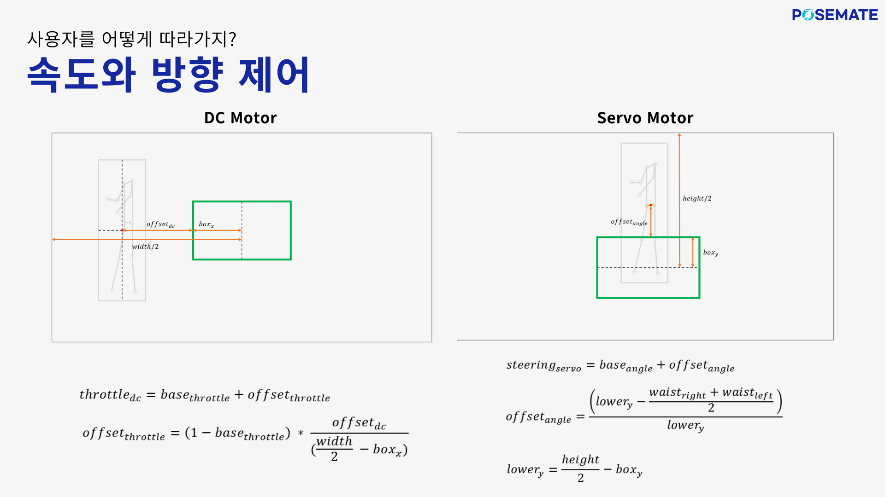
   
   
   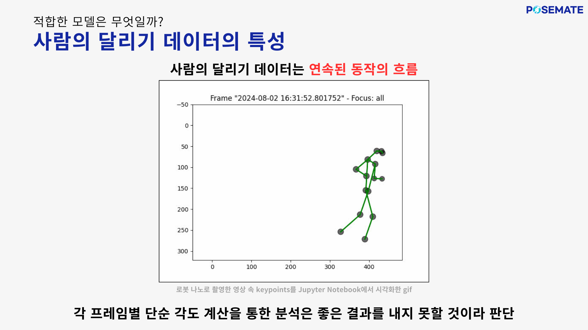
   
   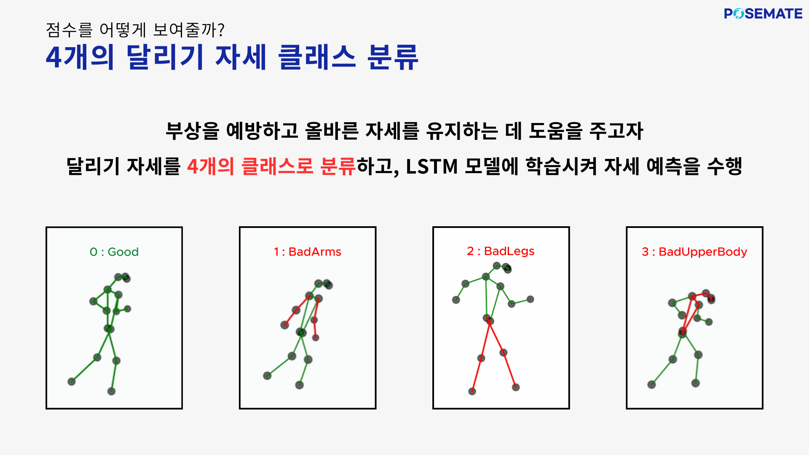
   
   
</p>


<br>

## 기술 스택

### 기술스택

- **Mobile** : React-Native-cli: 2.0.1, React-Native 0.74.3, NodeJS v8.20.4 LTS, Android Studio Koala.
- **BackEnd** : Oracle Java 17.0.12, Spring boot 3.3.1, SpringSecurity 6.3.1, JPA, Swagger 2.9.2, MariaDB 10.3.23
- **AI** : python 3.10.14, FAST-API 0.111.1, tensorflow 2.12.0
- **CI/CD** : Jenkins, Docker, AWS ec2
- **AIoT** : Jetson Orin Nano Dev-Kit, Python3.8.10, YOLOv8n-pose, YOLOv8s, OpenCV
- **이슈관리** : Git, Jira, Notion, Mattermost
<br>

## 아키텍쳐 
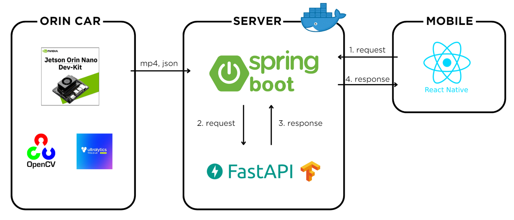

<br>
<br>


## APP 구성

```bash
📦src
 ┣ 📂analysis
 ┃ ┣ 📜AnalysisResult.js
 ┃ ┗ 📜AnalysisSelectScreen.js
 ┣ 📂api
 ┃ ┣ 📜ApiServer.js
 ┃ ┗ 📜Index.js
 ┣ 📂components
 ┃ ┣ 📜CarouselComponent.js
 ┃ ┣ 📜Input.js
 ┃ ┣ 📜LargeButton.js
 ┃ ┣ 📜Loading.js
 ┃ ┣ 📜SelectDevice.js
 ┃ ┗ 📜SelectServer.js
 ┣ 📂login
 ┃ ┣ 📜LoginScreen.js
 ┃ ┗ 📜SignInScreen.js
 ┣ 📂screens
 ┃ ┣ 📜HomeScreen.js
 ┃ ┗ 📜VideoTrim.js
 ┣ 📜App.js
 ┗ 📜config.js
```

### analysis

- 운동 정보 데이터 분석 결과 확인 페이지
- 운동 정보 데이터(영상)을 갤러리/서버 조회 선택할 수 있는 페이지

### 📂api

- 서버 조회 및 axios 요청 함수

### 📂components

- 버튼, Input box, Loading페이지 등을 컴포넌트화 하여 구현

### 📂login

- 로그인 및 회원가입 페이지

### 📂screens

- Home화면과 video Trim화면 페이지

### 🧩 App.js

- 내비게이션 기능 및 bottom Tab

### 1. 회원가입 (회원가입/로그인)

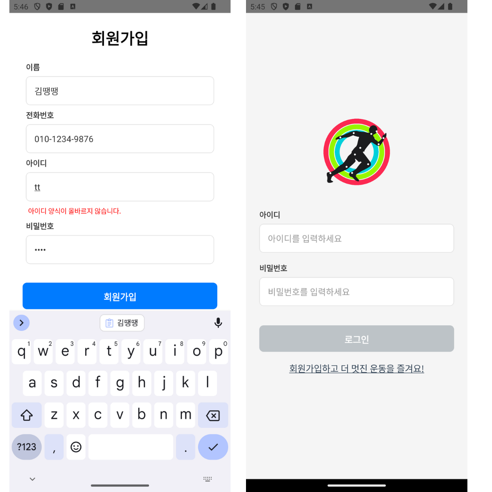

### 메인화면 (로그인 전/로그인 후)
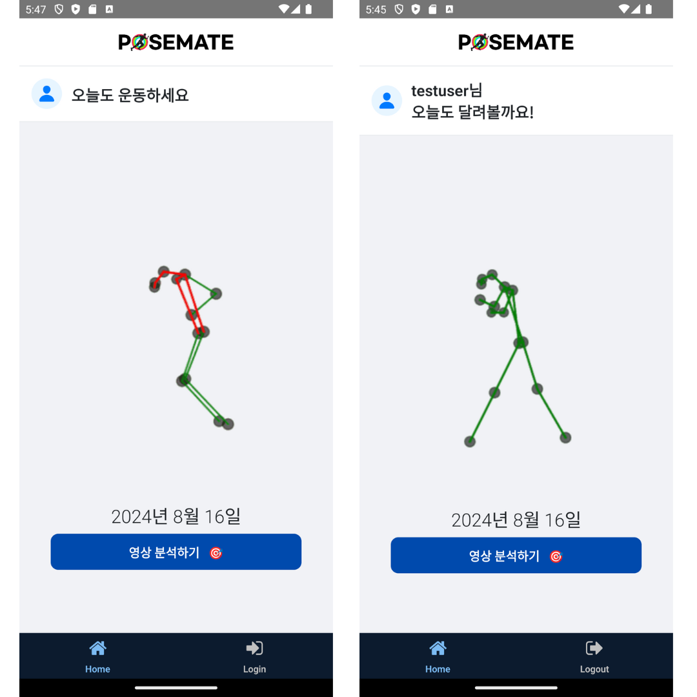

### 동영상 선택 (로봇카로 촬영한 영상 선택 / 갤러리에서 동영상 선택)
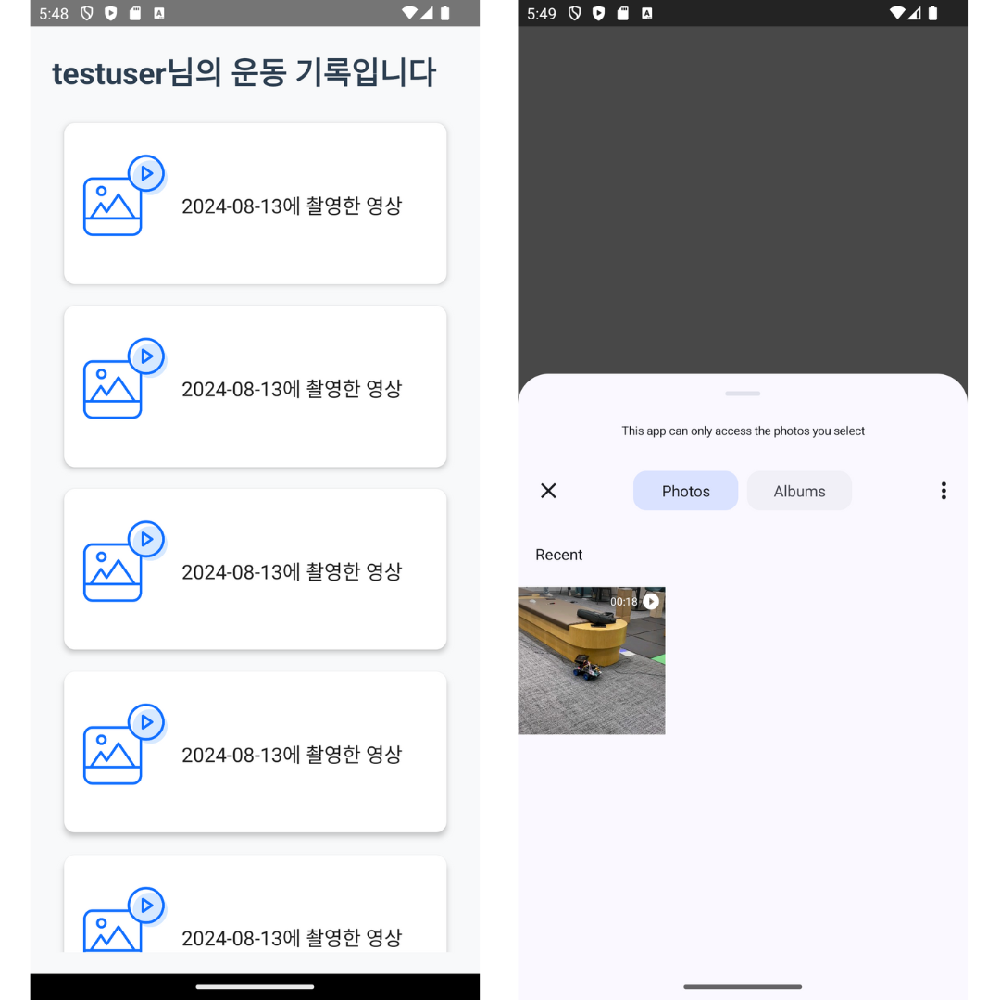

### 결과분석 (분석 결과 / 상세 분석 결과)
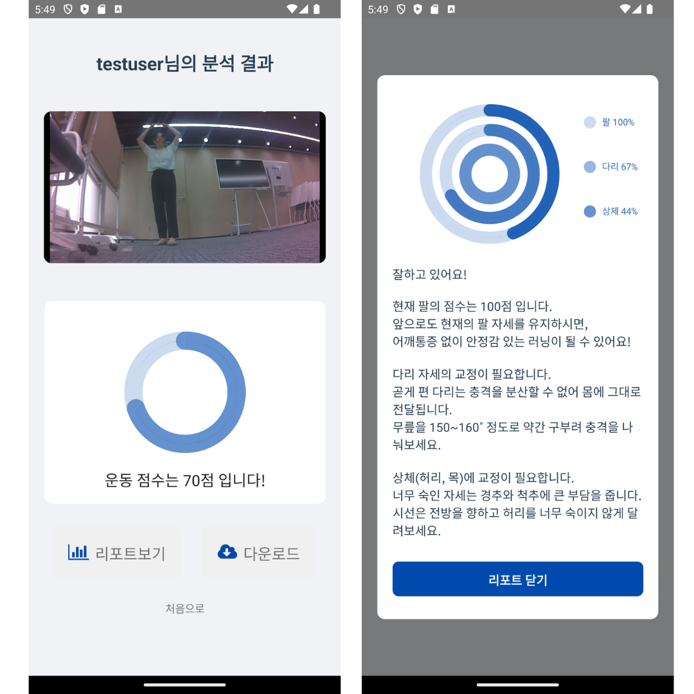

<br>

